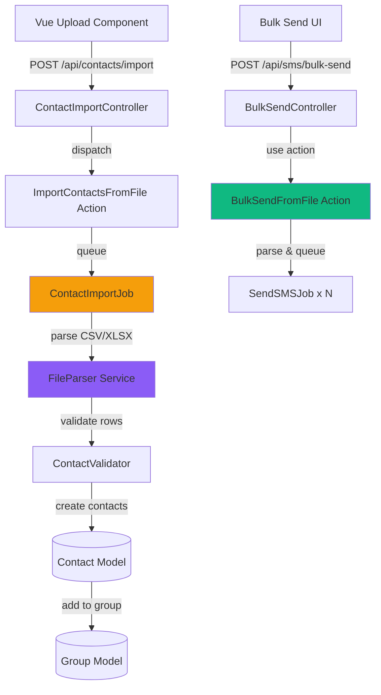

# Bulk Import & Messaging

Text Commander supports importing contacts from CSV/XLSX files and sending bulk SMS messages directly from uploaded files.

---

## Table of Contents

- [Overview](#overview)
- [CSV/XLSX Format Requirements](#csvxlsx-format-requirements)
- [Contact Import](#contact-import)
- [Bulk SMS from File](#bulk-sms-from-file)
- [Backend Architecture](#backend-architecture)
- [Frontend Components](#frontend-components)
- [API Endpoints](#api-endpoints)
- [Testing](#testing)

---

## Overview

Two main features:

1. **Contact Import** - Upload CSV/XLSX to bulk import contacts (with optional group assignment)
2. **Bulk SMS** - Upload CSV/XLSX with phone numbers and send SMS to all recipients

### Architecture Diagram



---

## CSV/XLSX Format Requirements

### Contact Import File Format

**Required columns:**
- `mobile` or `phone` - Phone number (E.164 or local format)

**Optional columns:**
- `name` - Contact name
- `email` - Email address
- Additional columns stored in `extra_attributes`

**Example CSV:**
```csv
mobile,name,email
+639171234567,Juan Dela Cruz,juan@example.com
09181234567,Maria Santos,maria@example.com
639191234567,Pedro Reyes,
```

**Example XLSX:**
| mobile | name | email |
|--------|------|-------|
| +639171234567 | Juan Dela Cruz | juan@example.com |
| 09181234567 | Maria Santos | maria@example.com |
| 639191234567 | Pedro Reyes | |

### Bulk SMS File Format

**Required columns:**
- `mobile` (or custom column name) - Phone number

**Example CSV:**
```csv
mobile,name
+639171234567,Juan
09181234567,Maria
639191234567,Pedro
```

---

## Contact Import

### Action: ImportContactsFromFile

**Path:** `app/Actions/Contacts/ImportContactsFromFile.php`

```php
namespace App\Actions\Contacts;

use App\Jobs\ContactImportJob;
use Illuminate\Http\UploadedFile;
use Illuminate\Http\JsonResponse;
use Lorisleiva\Actions\ActionRequest;
use Lorisleiva\Actions\Concerns\AsAction;

class ImportContactsFromFile
{
    use AsAction;

    public function handle(
        UploadedFile $file, 
        ?int $groupId = null,
        array $columnMapping = []
    ): array {
        // Store file temporarily
        $path = $file->store('imports', 'local');
        
        // Dispatch job for async processing
        ContactImportJob::dispatch($path, $groupId, $columnMapping);
        
        return [
            'status' => 'queued',
            'message' => 'Import queued for processing',
            'file_name' => $file->getClientOriginalName(),
        ];
    }

    public function rules(): array
    {
        return [
            'file' => 'required|file|mimes:csv,xlsx,xls|max:10240', // 10MB max
            'group_id' => 'nullable|exists:groups,id',
            'column_mapping' => 'nullable|array',
        ];
    }

    public function asController(ActionRequest $request): JsonResponse
    {
        $result = $this->handle(
            $request->file('file'),
            $request->group_id,
            $request->column_mapping ?? []
        );

        return response()->json($result, 202);
    }
}
```

### Job: ContactImportJob

**Path:** `app/Jobs/ContactImportJob.php`

```php
namespace App\Jobs;

use App\Services\FileParser;
use App\Models\Contact;
use App\Models\Group;
use Illuminate\Bus\Queueable;
use Illuminate\Contracts\Queue\ShouldQueue;
use Illuminate\Foundation\Bus\Dispatchable;
use Illuminate\Queue\InteractsWithQueue;
use Illuminate\Queue\SerializesModels;
use Illuminate\Support\Facades\Log;
use Illuminate\Support\Facades\Storage;

class ContactImportJob implements ShouldQueue
{
    use Dispatchable, InteractsWithQueue, Queueable, SerializesModels;

    public function __construct(
        public string $filePath,
        public ?int $groupId = null,
        public array $columnMapping = []
    ) {}

    public function handle()
    {
        $parser = new FileParser();
        $rows = $parser->parseFromPath(storage_path("app/{$this->filePath}"));
        
        $imported = 0;
        $failed = 0;
        
        foreach ($rows as $row) {
            try {
                $mobile = $row['mobile'] ?? $row['phone'] ?? null;
                
                if (!$mobile) {
                    $failed++;
                    continue;
                }
                
                $contact = Contact::createFromArray([
                    'mobile' => $mobile,
                    'name' => $row['name'] ?? null,
                    'email' => $row['email'] ?? null,
                ]);
                
                if ($contact && $this->groupId) {
                    $contact->groups()->syncWithoutDetaching([$this->groupId]);
                }
                
                $imported++;
            } catch (\Exception $e) {
                Log::warning('Failed to import contact', [
                    'row' => $row,
                    'error' => $e->getMessage(),
                ]);
                $failed++;
            }
        }
        
        Log::info('Contact import completed', [
            'imported' => $imported,
            'failed' => $failed,
            'group_id' => $this->groupId,
        ]);
        
        // Clean up temp file
        Storage::delete($this->filePath);
    }
}
```

**Usage:**

```php
// Via Action
ImportContactsFromFile::run($file, $groupId);

// Via API
POST /api/contacts/import
Content-Type: multipart/form-data

file: contacts.csv
group_id: 1
```

---

## Bulk SMS from File

### Action: BulkSendFromFile

**Path:** `app/Actions/SMS/BulkSendFromFile.php`

```php
namespace App\Actions\SMS;

use App\Services\FileParser;
use App\Jobs\SendSMSJob;
use Illuminate\Http\UploadedFile;
use Illuminate\Http\JsonResponse;
use Lorisleiva\Actions\ActionRequest;
use Lorisleiva\Actions\Concerns\AsAction;
use Propaganistas\LaravelPhone\PhoneNumber;

class BulkSendFromFile
{
    use AsAction;

    public function handle(
        UploadedFile $file,
        string $message,
        string $senderId,
        string $mobileColumn = 'mobile'
    ): array {
        $parser = new FileParser();
        $rows = $parser->parse($file);
        
        $queued = 0;
        $invalid = 0;
        $recipients = [];
        
        foreach ($rows as $row) {
            $mobile = $row[$mobileColumn] ?? null;
            
            if (!$mobile || !$this->validatePhone($mobile)) {
                $invalid++;
                continue;
            }
            
            // Normalize to E.164
            try {
                $phone = new PhoneNumber($mobile, 'PH');
                $e164Mobile = $phone->formatE164();
                
                SendSMSJob::dispatch($e164Mobile, $message, $senderId);
                
                $recipients[] = $e164Mobile;
                $queued++;
            } catch (\Exception $e) {
                $invalid++;
            }
        }
        
        return [
            'status' => 'queued',
            'queued' => $queued,
            'invalid' => $invalid,
            'recipients' => $recipients,
        ];
    }

    public function rules(): array
    {
        return [
            'file' => 'required|file|mimes:csv,xlsx,xls|max:5120', // 5MB max
            'message' => 'required|string|max:1600',
            'sender_id' => 'required|string',
            'mobile_column' => 'nullable|string',
        ];
    }

    public function asController(ActionRequest $request): JsonResponse
    {
        $result = $this->handle(
            $request->file('file'),
            $request->message,
            $request->sender_id,
            $request->mobile_column ?? 'mobile'
        );

        return response()->json($result, 202);
    }

    private function validatePhone(string $mobile): bool
    {
        try {
            $phone = new PhoneNumber($mobile, 'PH');
            return $phone->isValid();
        } catch (\Exception $e) {
            return false;
        }
    }
}
```

**Usage:**

```php
// Via Action
BulkSendFromFile::run($file, $message, $senderId);

// Via API
POST /api/sms/bulk-send
Content-Type: multipart/form-data

file: recipients.csv
message: "Hello from Text Commander!"
sender_id: "Quezon City"
mobile_column: "mobile"
```

---

## Backend Architecture

### Service: FileParser

**Path:** `app/Services/FileParser.php`

```php
namespace App\Services;

use Illuminate\Http\UploadedFile;
use Illuminate\Support\Facades\Storage;
use League\Csv\Reader;
use PhpOffice\PhpSpreadsheet\IOFactory;

class FileParser
{
    public function parse(UploadedFile $file): array
    {
        $extension = $file->getClientOriginalExtension();
        
        return match($extension) {
            'csv' => $this->parseCsv($file),
            'xlsx', 'xls' => $this->parseExcel($file),
            default => throw new \InvalidArgumentException('Unsupported file type'),
        };
    }

    public function parseFromPath(string $path): array
    {
        $extension = pathinfo($path, PATHINFO_EXTENSION);
        
        return match($extension) {
            'csv' => $this->parseCsvFromPath($path),
            'xlsx', 'xls' => $this->parseExcelFromPath($path),
            default => throw new \InvalidArgumentException('Unsupported file type'),
        };
    }

    private function parseCsv(UploadedFile $file): array
    {
        $csv = Reader::createFromPath($file->getRealPath());
        $csv->setHeaderOffset(0); // First row is header
        
        return iterator_to_array($csv->getRecords());
    }

    private function parseCsvFromPath(string $path): array
    {
        $csv = Reader::createFromPath($path);
        $csv->setHeaderOffset(0);
        
        return iterator_to_array($csv->getRecords());
    }

    private function parseExcel(UploadedFile $file): array
    {
        $spreadsheet = IOFactory::load($file->getRealPath());
        $worksheet = $spreadsheet->getActiveSheet();
        
        return $this->extractRows($worksheet);
    }

    private function parseExcelFromPath(string $path): array
    {
        $spreadsheet = IOFactory::load($path);
        $worksheet = $spreadsheet->getActiveSheet();
        
        return $this->extractRows($worksheet);
    }

    private function extractRows($worksheet): array
    {
        $rows = [];
        $headers = [];
        
        foreach ($worksheet->getRowIterator() as $rowIndex => $row) {
            $cellIterator = $row->getCellIterator();
            $cellIterator->setIterateOnlyExistingCells(false);
            
            $rowData = [];
            foreach ($cellIterator as $cell) {
                $rowData[] = $cell->getValue();
            }
            
            if ($rowIndex === 1) {
                // First row is header
                $headers = array_map('strtolower', array_map('trim', $rowData));
            } else {
                // Skip empty rows
                if (empty(array_filter($rowData))) {
                    continue;
                }
                
                $rows[] = array_combine($headers, $rowData);
            }
        }
        
        return $rows;
    }
}
```

### Controllers

**ContactImportController:**

```php
namespace App\Http\Controllers;

use App\Actions\Contacts\ImportContactsFromFile;
use Illuminate\Http\Request;

class ContactImportController extends Controller
{
    public function store(Request $request)
    {
        return ImportContactsFromFile::run(
            $request->file('file'),
            $request->group_id,
            $request->column_mapping ?? []
        );
    }
}
```

**BulkSendController:**

```php
namespace App\Http\Controllers;

use App\Actions\SMS\BulkSendFromFile;
use Illuminate\Http\Request;

class BulkSendController extends Controller
{
    public function store(Request $request)
    {
        return BulkSendFromFile::run(
            $request->file('file'),
            $request->message,
            $request->sender_id,
            $request->mobile_column ?? 'mobile'
        );
    }
}
```

### Routes

**File:** `routes/api.php`

```php
use App\Http\Controllers\ContactImportController;
use App\Http\Controllers\BulkSendController;

Route::middleware('auth:sanctum')->group(function () {
    // Import contacts from CSV/XLSX
    Route::post('/contacts/import', [ContactImportController::class, 'store']);
    
    // Bulk send SMS from CSV/XLSX
    Route::post('/sms/bulk-send', [BulkSendController::class, 'store']);
});
```

---

## Frontend Components

### Contact Import Modal

**File:** `resources/js/components/contacts/import-modal.vue`

```vue
<template>
  <Dialog :open="open" @update:open="$emit('update:open', $event)">
    <DialogContent>
      <DialogHeader>
        <DialogTitle>Import Contacts</DialogTitle>
        <DialogDescription>
          Upload a CSV or XLSX file to bulk import contacts
        </DialogDescription>
      </DialogHeader>
      
      <form @submit.prevent="handleSubmit" class="space-y-4">
        <!-- File Upload -->
        <div>
          <label class="block text-sm font-medium mb-2">
            Upload CSV or XLSX
          </label>
          <input
            type="file"
            accept=".csv,.xlsx,.xls"
            @change="handleFileChange"
            class="block w-full border rounded px-3 py-2"
          />
          <p class="text-sm text-gray-500 mt-1">
            Required: <code>mobile</code> or <code>phone</code> column<br/>
            Optional: <code>name</code>, <code>email</code>
          </p>
        </div>

        <!-- Group Selection -->
        <div>
          <label class="block text-sm font-medium mb-2">
            Add to Group (Optional)
          </label>
          <select 
            v-model="form.group_id" 
            class="w-full border rounded px-3 py-2"
          >
            <option :value="null">No group</option>
            <option 
              v-for="group in groups" 
              :key="group.id" 
              :value="group.id"
            >
              {{ group.name }} ({{ group.contacts_count }} contacts)
            </option>
          </select>
        </div>

        <!-- Preview -->
        <div v-if="file" class="bg-gray-50 p-3 rounded text-sm">
          <strong>Selected:</strong> {{ file.name }}<br/>
          <strong>Size:</strong> {{ formatFileSize(file.size) }}
        </div>

        <!-- Submit -->
        <div class="flex gap-2">
          <button
            type="button"
            @click="$emit('update:open', false)"
            class="btn-secondary flex-1"
          >
            Cancel
          </button>
          <button
            type="submit"
            :disabled="!file || loading"
            class="btn-primary flex-1"
          >
            {{ loading ? 'Importing...' : 'Import Contacts' }}
          </button>
        </div>
      </form>
    </DialogContent>
  </Dialog>
</template>

<script setup lang="ts">
import { ref } from 'vue'
import { router } from '@inertiajs/vue3'
import type { Group } from '@/types/models'

const props = defineProps<{
  open: boolean
  groups: Group[]
}>()

const emit = defineEmits(['update:open'])

const file = ref<File | null>(null)
const form = ref({ group_id: null as number | null })
const loading = ref(false)

const handleFileChange = (e: Event) => {
  const target = e.target as HTMLInputElement
  file.value = target.files?.[0] || null
}

const formatFileSize = (bytes: number): string => {
  if (bytes < 1024) return bytes + ' B'
  if (bytes < 1024 * 1024) return (bytes / 1024).toFixed(1) + ' KB'
  return (bytes / (1024 * 1024)).toFixed(1) + ' MB'
}

const handleSubmit = () => {
  if (!file.value) return

  const formData = new FormData()
  formData.append('file', file.value)
  if (form.value.group_id) {
    formData.append('group_id', String(form.value.group_id))
  }

  loading.value = true

  router.post('/api/contacts/import', formData, {
    onSuccess: () => {
      emit('update:open', false)
      // Show toast notification
    },
    onError: (errors) => {
      console.error('Import failed:', errors)
    },
    onFinish: () => {
      loading.value = false
    },
  })
}
</script>
```

### Bulk Send Modal

**File:** `resources/js/components/sms/bulk-send-modal.vue`

```vue
<template>
  <Dialog :open="open" @update:open="$emit('update:open', $event)">
    <DialogContent class="max-w-2xl">
      <DialogHeader>
        <DialogTitle>Bulk Send from File</DialogTitle>
        <DialogDescription>
          Upload a CSV/XLSX file with phone numbers to send SMS in bulk
        </DialogDescription>
      </DialogHeader>
      
      <form @submit.prevent="handleSubmit" class="space-y-4">
        <!-- File Upload -->
        <div>
          <label class="block text-sm font-medium mb-2">
            Upload CSV or XLSX
          </label>
          <input
            type="file"
            accept=".csv,.xlsx,.xls"
            @change="handleFileChange"
            class="block w-full border rounded px-3 py-2"
          />
          <p class="text-sm text-gray-500 mt-1">
            File must contain a column with phone numbers
          </p>
        </div>

        <!-- Mobile Column Name -->
        <div>
          <label class="block text-sm font-medium mb-2">
            Phone Number Column Name
          </label>
          <input
            v-model="form.mobile_column"
            type="text"
            placeholder="mobile"
            class="w-full border rounded px-3 py-2"
          />
          <p class="text-sm text-gray-500 mt-1">
            The column name in your file that contains phone numbers
          </p>
        </div>

        <!-- Message -->
        <div>
          <label class="block text-sm font-medium mb-2">
            Message
          </label>
          <textarea
            v-model="form.message"
            rows="4"
            maxlength="1600"
            class="w-full border rounded px-3 py-2"
            placeholder="Enter your message..."
          />
          <p class="text-sm text-gray-500 mt-1">
            {{ form.message.length }} / 1600 characters
          </p>
        </div>

        <!-- Sender ID -->
        <div>
          <label class="block text-sm font-medium mb-2">
            Sender ID
          </label>
          <select 
            v-model="form.sender_id" 
            class="w-full border rounded px-3 py-2"
          >
            <option 
              v-for="sender in senderIds" 
              :key="sender.id" 
              :value="sender.id"
            >
              {{ sender.name }}
            </option>
          </select>
        </div>

        <!-- Preview -->
        <div v-if="file" class="bg-blue-50 border border-blue-200 p-3 rounded text-sm">
          <strong>File:</strong> {{ file.name }}<br/>
          <strong>Will send to:</strong> All valid phone numbers in the file
        </div>

        <!-- Submit -->
        <div class="flex gap-2">
          <button
            type="button"
            @click="$emit('update:open', false)"
            class="btn-secondary flex-1"
          >
            Cancel
          </button>
          <button
            type="submit"
            :disabled="!canSubmit || loading"
            class="btn-primary flex-1"
          >
            {{ loading ? 'Sending...' : 'Send to All' }}
          </button>
        </div>
      </form>
    </DialogContent>
  </Dialog>
</template>

<script setup lang="ts">
import { ref, computed } from 'vue'
import { router } from '@inertiajs/vue3'
import type { SenderID } from '@/types/models'

const props = defineProps<{
  open: boolean
  senderIds: SenderID[]
}>()

const emit = defineEmits(['update:open'])

const file = ref<File | null>(null)
const form = ref({
  mobile_column: 'mobile',
  message: '',
  sender_id: props.senderIds[0]?.id || '',
})
const loading = ref(false)

const canSubmit = computed(() => 
  file.value && form.value.message && form.value.sender_id
)

const handleFileChange = (e: Event) => {
  const target = e.target as HTMLInputElement
  file.value = target.files?.[0] || null
}

const handleSubmit = () => {
  if (!canSubmit.value) return

  const formData = new FormData()
  formData.append('file', file.value!)
  formData.append('message', form.value.message)
  formData.append('sender_id', form.value.sender_id)
  formData.append('mobile_column', form.value.mobile_column)

  loading.value = true

  router.post('/api/sms/bulk-send', formData, {
    onSuccess: () => {
      emit('update:open', false)
      // Show toast notification
    },
    onError: (errors) => {
      console.error('Bulk send failed:', errors)
    },
    onFinish: () => {
      loading.value = false
    },
  })
}
</script>
```

---

## API Endpoints

### Import Contacts

```http
POST /api/contacts/import
Content-Type: multipart/form-data
Authorization: Bearer {token}

file: contacts.csv
group_id: 1 (optional)
```

**Response (202 Accepted):**

```json
{
  "status": "queued",
  "message": "Import queued for processing",
  "file_name": "contacts.csv"
}
```

### Bulk Send SMS

```http
POST /api/sms/bulk-send
Content-Type: multipart/form-data
Authorization: Bearer {token}

file: recipients.csv
message: "Hello from Text Commander!"
sender_id: "Quezon City"
mobile_column: "mobile" (optional, default: "mobile")
```

**Response (202 Accepted):**

```json
{
  "status": "queued",
  "queued": 150,
  "invalid": 3,
  "recipients": ["+639171234567", "+639181234567", "..."]
}
```

---

## Testing

### Factory

**File:** `database/factories/ContactFactory.php` (enhance existing)

```php
public function withMobile(string $mobile): static
{
    return $this->state(fn (array $attributes) => [
        'mobile' => $mobile,
    ]);
}

public function batch(int $count): array
{
    $contacts = [];
    for ($i = 0; $i < $count; $i++) {
        $contacts[] = $this->create();
    }
    return $contacts;
}
```

### Tests

**File:** `tests/Feature/ImportContactsFromFileTest.php`

```php
use App\Actions\Contacts\ImportContactsFromFile;
use App\Jobs\ContactImportJob;
use Illuminate\Http\UploadedFile;
use Illuminate\Support\Facades\Queue;

test('can import contacts from CSV', function () {
    Queue::fake();
    
    $csv = UploadedFile::fake()->createWithContent('contacts.csv', 
        "mobile,name\n+639171234567,Juan\n+639181234567,Maria"
    );
    
    $result = ImportContactsFromFile::run($csv);
    
    expect($result['status'])->toBe('queued');
    Queue::assertPushed(ContactImportJob::class);
});

test('can import contacts with group assignment', function () {
    $group = Group::factory()->create();
    
    $csv = UploadedFile::fake()->createWithContent('contacts.csv',
        "mobile,name\n+639171234567,Juan"
    );
    
    ImportContactsFromFile::run($csv, $group->id);
    
    // Process job
    ContactImportJob::dispatchSync(storage_path('app/imports/contacts.csv'), $group->id);
    
    expect(Contact::count())->toBe(1);
    expect($group->contacts()->count())->toBe(1);
});
```

**File:** `tests/Feature/BulkSendFromFileTest.php`

```php
use App\Actions\SMS\BulkSendFromFile;
use App\Jobs\SendSMSJob;
use Illuminate\Http\UploadedFile;
use Illuminate\Support\Facades\Queue;

test('can bulk send from CSV', function () {
    Queue::fake();
    
    $csv = UploadedFile::fake()->createWithContent('recipients.csv',
        "mobile\n+639171234567\n+639181234567"
    );
    
    $result = BulkSendFromFile::run($csv, 'Test message', 'TestSender');
    
    expect($result['status'])->toBe('queued');
    expect($result['queued'])->toBe(2);
    Queue::assertPushed(SendSMSJob::class, 2);
});

test('skips invalid phone numbers', function () {
    Queue::fake();
    
    $csv = UploadedFile::fake()->createWithContent('recipients.csv',
        "mobile\n+639171234567\ninvalid\n+639181234567"
    );
    
    $result = BulkSendFromFile::run($csv, 'Test', 'TestSender');
    
    expect($result['queued'])->toBe(2);
    expect($result['invalid'])->toBe(1);
});
```

---

## Required Packages

Install these dependencies:

```bash
composer require league/csv
composer require phpoffice/phpspreadsheet
```

---

## Related Documentation

- [Backend Services](backend-services.md) - Actions and Jobs
- [Contact Management](contact-package.md) - Contact model
- [API Documentation](api-documentation.md) - API reference
- [Frontend Scaffolding](frontend-scaffolding.md) - Vue components
- [Test Scaffolding](test-scaffolding.md) - Testing guide
