# Text Commander (txtcmdr)

A fast-deployable SMS broadcasting system with a branded sender ID. Built with Laravel 12, Inertia.js, Vue 3, and PostgreSQL.

## 🚀 Quick Links
- [Quick Start](quick-start.md)
- [Development Plan](development-plan.md)
- [API Documentation](api-documentation.md)

## 📚 Documentation Map

```mermaid
flowchart TB
    Start(["🏠 Text Commander Docs"])
    
    Start --> GettingStarted["📖 Getting Started"]
    Start --> DevPlan["📋 Development Plan"]
    Start --> CoreFeatures["⚡ Core Features"]
    Start --> API["🔌 API Reference"]
    Start --> Backend["🔧 Backend"]
    Start --> Frontend["🎨 Frontend"]
    Start --> Testing["🧪 Testing"]
    Start --> Operations["⚙️ Operations"]
    
    GettingStarted --> QS["Quick Start"]
    GettingStarted --> PA["Package Architecture"]
    
    CoreFeatures --> SMS["SMS Broadcasting"]
    CoreFeatures --> Schedule["Scheduled Messaging"]
    CoreFeatures --> Blacklist["Blacklist/No-Send"]
    CoreFeatures --> Groups["Group Management"]
    CoreFeatures --> Contacts["Contact Management"]
    
    SMS --> PhoneNorm["Phone Normalization"]
    SMS --> Integration["EngageSpark Integration"]
    
    API --> APIDoc["API Documentation"]
    API --> DTOs["Interfaces & DTOs"]
    
    Backend --> DB["📊 Database Schema"]
    Backend --> Services["Backend Services"]
    Backend --> Models["Models"]
    Backend --> Jobs["Jobs & Commands"]
    Backend --> Middleware["Middleware"]
    Backend --> Controllers["Controllers"]
    Backend --> Packages["📦 Third-Party Packages"]
    
    Frontend --> FrontendScaf["Vue/Inertia Scaffolding"]
    Frontend --> UIUX["UI/UX Design"]
    Frontend --> Wireframes["Wireframes"]
    
    Testing --> TestScaf["Test Scaffolding (Pest)"]
    
    Operations --> Security["🔐 Security & Compliance"]
    Operations --> Events["Events & Listeners"]
    Operations --> Notifications["Notifications"]
    Operations --> Logging["Logging & Monitoring"]
    Operations --> Deployment["DevOps & Deployment"]
    
    Start --> Appendices["📚 Appendices"]
    Appendices --> Reference["Reference Guide"]
    Appendices --> TODO["Documentation TODO"]
    
    style Start fill:#4f46e5,stroke:#312e81,stroke-width:3px,color:#fff
    style CoreFeatures fill:#10b981,stroke:#047857,color:#fff
    style Backend fill:#f59e0b,stroke:#d97706,color:#fff
    style Frontend fill:#ec4899,stroke:#be185d,color:#fff
    style Operations fill:#8b5cf6,stroke:#6d28d9,color:#fff
```

### 1) Getting Started
- [Quick Start](quick-start.md)
- [Package Architecture](package-architecture.md)

### 2) Core Features
- [SMS Integration](sms-integration.md)
- [Phone Normalization](phone-normalization.md)
- [Scheduled Messaging](scheduled-messaging.md)
- [Blacklist (No-Send List)](blacklist-feature.md)
- [Group Management](group-management.md)
- [Contact Management](contact-package.md)

### 3) API Reference
- [API Documentation](api-documentation.md)
- [Interfaces & DTOs](interfaces-and-dtos.md)

### 4) Database
- [Database Schema](database-schema.md)

### 5) Backend Architecture
- [Backend Services](backend-services.md)
- [Models](models.md)
- [Jobs & Commands](jobs-commands.md)
- [Middleware](middleware.md)

### 6) Controllers
- [Controller Scaffolding](controller-scaffolding.md)

### 7) Frontend
- [Frontend Scaffolding](frontend-scaffolding.md)
- [UI/UX Design](ui-ux-design.md)
- [Wireframes](wireframes.md)

### 8) Testing
- [Test Scaffolding](test-scaffolding.md)

### 9) Third-Party Packages
- [Package Overview](packages.md)

### 10) Security & Compliance
- [Security Guide](security.md)

### 11) Operations
- [Jobs, Events & Listeners](events-listeners.md)
- [Notifications](notifications.md)
- [Logging & Monitoring](logging-monitoring.md)
- [DevOps & Deployment](deployment.md)

### 12) Appendices
- [Reference Guide](appendices.md)
- [Documentation TODO](TODO-SECTIONS.md)
